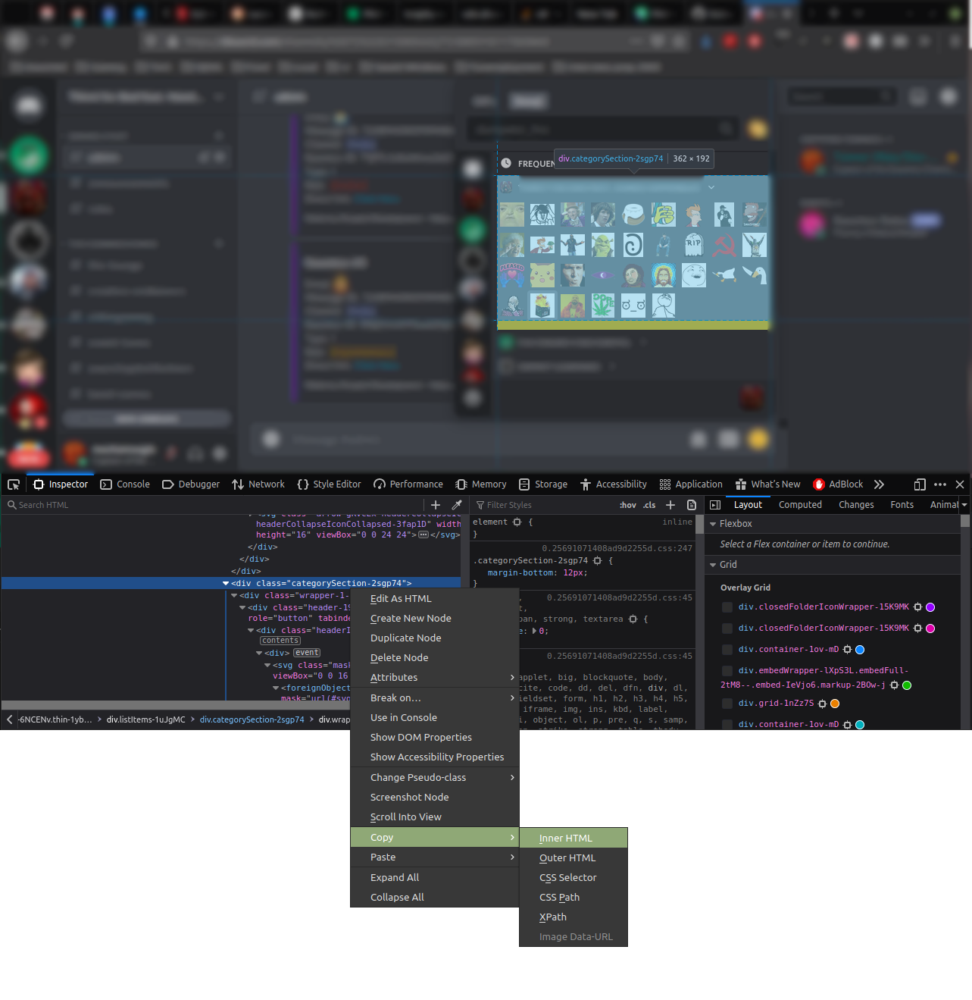

# Discord Emoji Extractor

A tiny Go tool to extract emoji from the HTML of a Discord server emoji list.

This tool parses through the HTML elements in the Discord emoji tray, gathers the `:key:` names and source URLs, and downloads those emoji.
It requires a small amount of manual work from the user in gathering the HTML from the Discord server, but the tradeoff for this is that you don't need to interact with the Discord API.

## Usage

1. [Get this tool](#1-get-this-tool)
2. [Get the HTML](#2-get-the-html)
3. [Prep your filesystem](#3-prep-your-filesystem)
4. [Make it so!](#4-make-it-so)

### 1. Get this tool

Clone this repo, and either `go build` your own binary to use, or plan to do it live with `go run PATH/TO/main.go`.
If I've gotten around to uploading pre-made binaries, you can just grab one of those from the Releases tab.

### 2. Get the HTML

You'll want to log into Discord using a web browser.
Then, navigate to the server whose emoji you want to archive and open the emoji panel.
Adjust the view so that the server's emoji are in view, then pop open the developer tools.
In the DOM Inspector, select the `<div class="categorySection-2sgp74">` element for that server.
Right-click that element, and copy the **Inner HTML** to your clipboard.

Using a text editor, create a new file and paste in that HTML.
Save the file, and make sure it's named according to the Discord server.



If you can't fit all of the server's emoji in a single view of the emoji tray, that's okay.
The HTML changes depending on which emoji are visible in the tray, so you can keep scrolling the emoji list and copying & pasting the **Inner HTML** into the file.

If you want to extract the emoji from multiple servers, you can do that too.
I recommend spewing the HTML into a separate file for each Discord server.

### 3. Prep your filesystem

The tool will create a new `downloaded_emoji/` directory in your current working directory, so make sure that your terminal is in an acceptable location.
It assumes that all the files within the current working directory are files that contain Discord HTML.

I recommend something like the following:

```bash
~/Downloads/
  ...
  ├── discord-HTML/  <-- this should be your CWD
  │   ├── server_A_html
  │   ├── server_B_html
  │   └── server_C_html
  ├── go-emoji-extractor/
  │   └── go-emoji-extractor-binary
  ...
```

### 4. Make it so!

In this using that example directory structure, you would run the following two commands:

```bash
cd ~/Downloads/discord-HTML/

../go-emoji-extractor/go-emoji-extractor-binary
```
